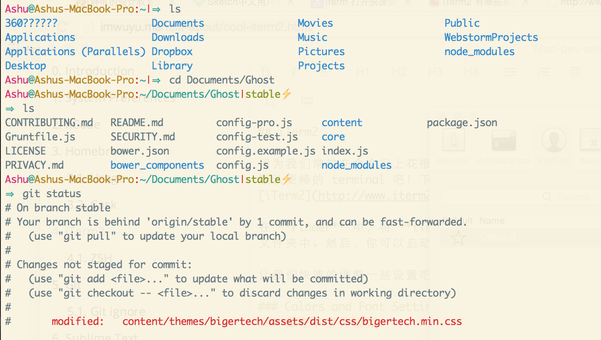

## iTerm2

作为一名开发者，我们常常花上很多时间在终端 上，如同武士的剑，一出手便知高低。所以让我们安装 Mac 上最强大的终端 [iTerm2](http://www.iterm2.com/) 吧！写码除虫，居家必备。

在 Finder 中，将 iTerm 拖拽进入 Application 文件夹中。然后，你可以在 Launchpad 中启动 iTerm。

### 颜色和字体设置


- 在 Keys -> Hotkey 中设置 command + option + i 快速显示和隐藏 iTerm
- 在 Profiles -> Default -> Check silence bell
- 下载 [Solarized dark iterm colors](https://github.com/altercation/solarized/tree/master/iterm2-colors-solarized)，在 Profiles -> Default -> Colors -> Load Presets 将其导入，作为默认颜色。
- 在 Profiles -> Text 改变游标（cursor）文字和颜色，随个人喜好。
- 更多设置，可参考 [打造好用的终端](http://imwuyu.me/talk-about/cool-iterm2.html/)
  
  
  
## Zsh  

我们将安装 zsh ，其拓展功能和主题将由 oh-my-zsh 提供。其中Env.sh 文件用于维护别名（aliases），输出（exports）和路径改变（path changes）等等，以免影响 ~/.zshrc。

### Zsh

使用 Homebrew 完成 zsh 和 zsh completions 的安装
  
```
    brew install zsh zsh-completions 
```  

安装 oh-my-zsh 让 zsh 获得拓展功能和主题
  
```
    curl -L https://github.com/robbyrussell/oh-my-zsh/raw/master/tools/install.sh | sh  
```  

用文本编辑器或 vi 打开 .zshrc 进行以下编辑:
  
```
    ZSH_THEME=pygmalion
    alias zshconfig="vi ~/.zshrc"
    alias envconfig="vi ~/Projects/config/env.sh"
    plugins=(git colored-man colorize github jira vagrant virtualenv pip python brew osx zsh-syntax-highlighting)  
```  

用文本编辑器或 vi 打开 ~/Projects/config/env.sh 进行以下编辑:
  
```
    #!/bin/zsh

    # PATH
    export PATH="/usr/local/share/python:/usr/local/bin:/usr/bin:/bin:/usr/sbin:/sbin"
    export EDITOR='vi -w'
    # export PYTHONPATH=$PYTHONPATH
    # export MANPATH="/usr/local/man:$MANPATH"

    # Virtual Environment
    export WORKON_HOME=$HOME/.virtualenvs
    export PROJECT_HOME=$HOME/Projects
    source /usr/local/bin/virtualenvwrapper.sh

    # Owner
    export USER_NAME="YOUR NAME"
    eval "$(rbenv init -)"

    # FileSearch
    function f() { find . -iname "*$1*" ${@:2} }
    function r() { grep "$1" ${@:2} -R . }

    #mkdir and cd
    function mkcd() { mkdir -p "$@" && cd "$_"; }

    # Aliases
    alias cppcompile='c++ -std=c++11 -stdlib=libc++'  
```  

译注：

如果是新增环境变量或者是修改环境变量的值，都需要 source 一下才能立即生效。

如果是删除一个环境变量，必须输入 exit 以 logout 当前 shell ，然后再重新打开一个新的 shell 并 login 才能生效。